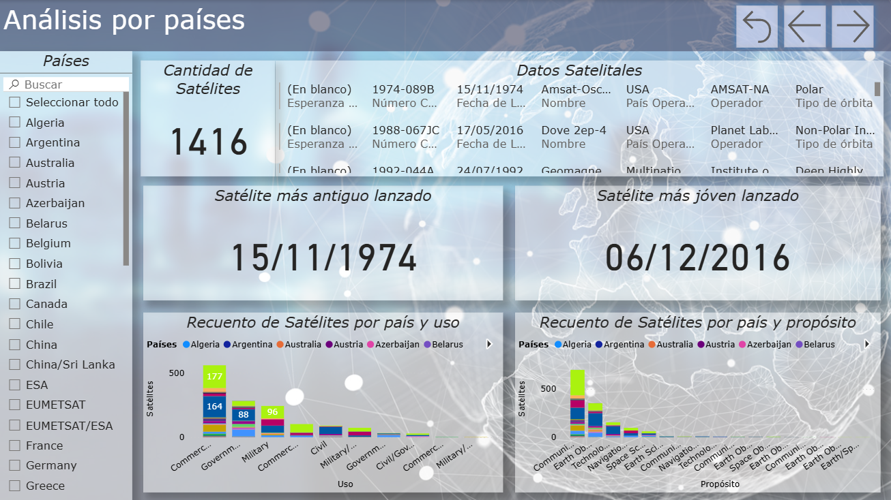
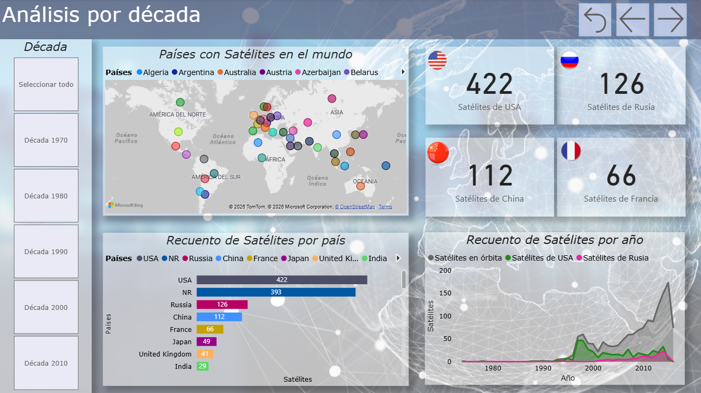
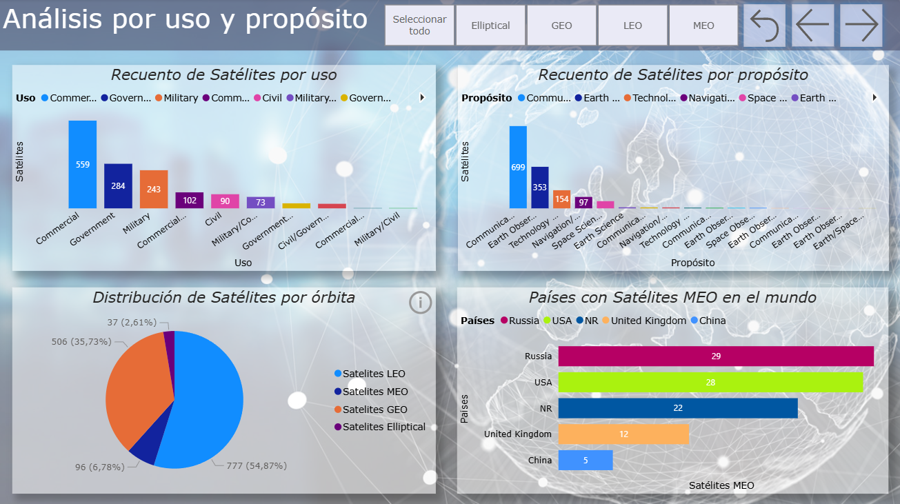

# Earth's Active Satellites - Data Visualization Project

This project focuses on the analysis and visualization of data regarding active satellites currently orbiting Earth. Using **Power BI**, I transformed raw data into an interactive dashboard to uncover trends, distributions, and technical insights about our planet's satellite network.

## Project Overview

The main objective was to apply advanced data visualization techniques to communicate complex astronomical and technical data effectively.

### Key Features:
* **Interactive Dashboards:** Comprehensive views of satellite distributions by orbit, purpose, and country.
* **Custom Measures:** Implementation of DAX measures for in-depth statistical analysis.
* **Advanced Tooltips:** Interactive details that appear when hovering over data points to provide extra context without cluttering the view.
* **Trend Analysis:** Visual representation of satellite launches and operational status over time.

##  Tech Stack

* **Data Visualization:** [Microsoft Power BI](https://powerbi.microsoft.com/)
* **Data Processing:** Excel / Power Query
* **Domain:** Astronomy & Satellite Technology

##  Repository Structure

* `Satélites activos en órbita alrededor de La Tierra... .pbix`: The main Power BI project file including all dashboards and data models.
* `Dataset_Tablas.xlsx`: The source dataset containing active satellite information.

##  How to View the Project

1. Download the `.pbix` file from this repository.
2. Install [Power BI Desktop](https://powerbi.microsoft.com/desktop/) (Free).
3. Open the file to interact with the filters and visualizations.

##  Images

##  Author

**Lihuén Natale** Astronomy Student at **Universidad Nacional de La Plata (UNLP)**.  
*Passionate about Data Science and its application in scientific fields.*
